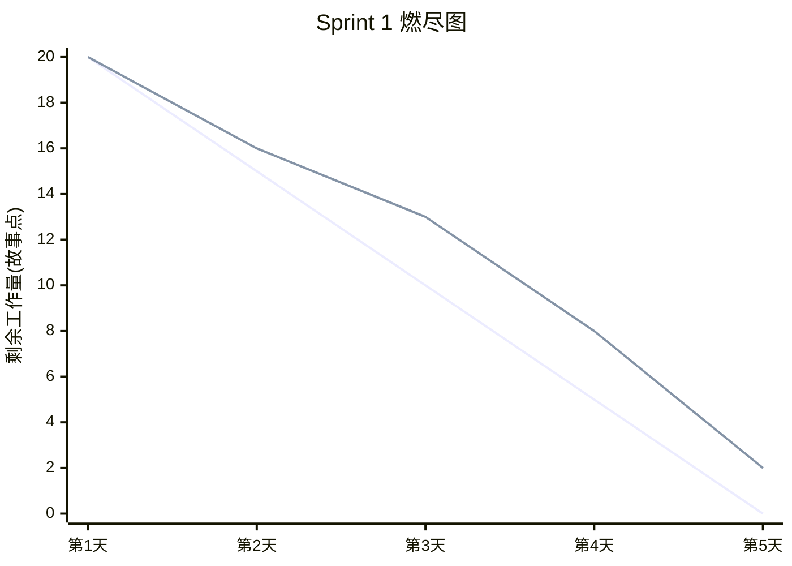

# Sprint 1 报告 · 核心骨架与基础 Roast

## Sprint 目标

搭建项目骨架，打通「提交代码 → LLM 评审 → 落库 → 前端展示」的最小闭环，并建立测试与 CI 基线。

## 完成的功能点

| 编号 | 功能点 | 对应 US | 状态 |
| --- | --- | --- | --- |
| 1 | FastAPI 应用骨架与配置加载（`core/config.py`） | US01 | ✅ |
| 2 | `POST /roast` 接口，调用 LLM 返回 `roast_text`/`chaos_score`/`suggestions` | US01 | ✅ |
| 3 | LLM 客户端封装（OpenAI 兼容 + 本地回退生成器） | US01 | ✅ |
| 4 | `analyses` 表 ORM 模型与落库 | US01 | ✅ |
| 5 | 前端 `RoastForm` + `ResultDisplay` 基础交互 | US01 | ✅ |
| 6 | pytest 单元测试 + pytest-bdd 场景测试 | — | ✅ |
| 7 | GitHub Actions CI（lint + test） | — | ✅ |

## 燃尽图



## 遇到的挑战与解决方案

| 挑战 | 解决方案 |
| --- | --- |
| 未配置 LLM 密钥时接口无法运行 | 实现**确定性本地回退生成器**，测试/演示零依赖 |
| LLM 返回 JSON 不稳定（带 Markdown 围栏） | 剥离 ``` 围栏 + `json` 前缀后解析，失败回退 |
| 测试需隔离数据库 | conftest 强制 `sqlite:///:memory:`，测试前后建表/删表 |

## 测试结果

```text
单元测试：test_health / test_roast_* / test_get_roast_* / test_stats_* 全部通过
BDD 场景：roast.feature 4 个场景全部通过
覆盖率：核心 service/core 模块 > 70%
```

## 下个 Sprint 计划

- Sprint 2 将实现 `/stats` 统计接口、前端统计面板、赛博朋克样式，以及输入校验、限流与日志等防御性编程。
