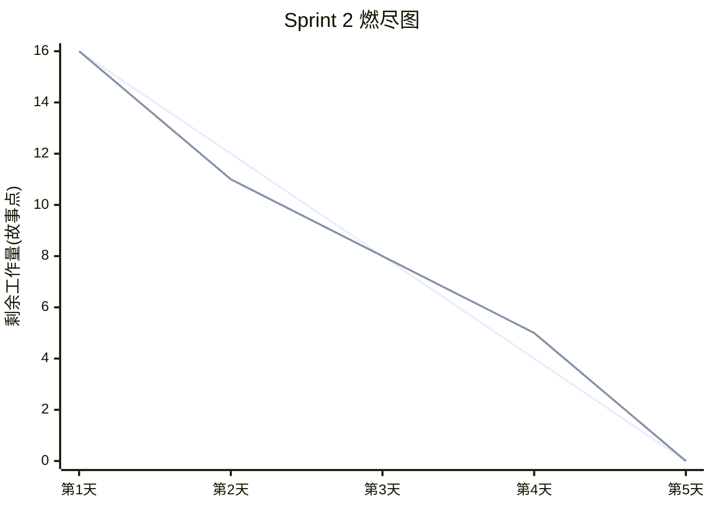
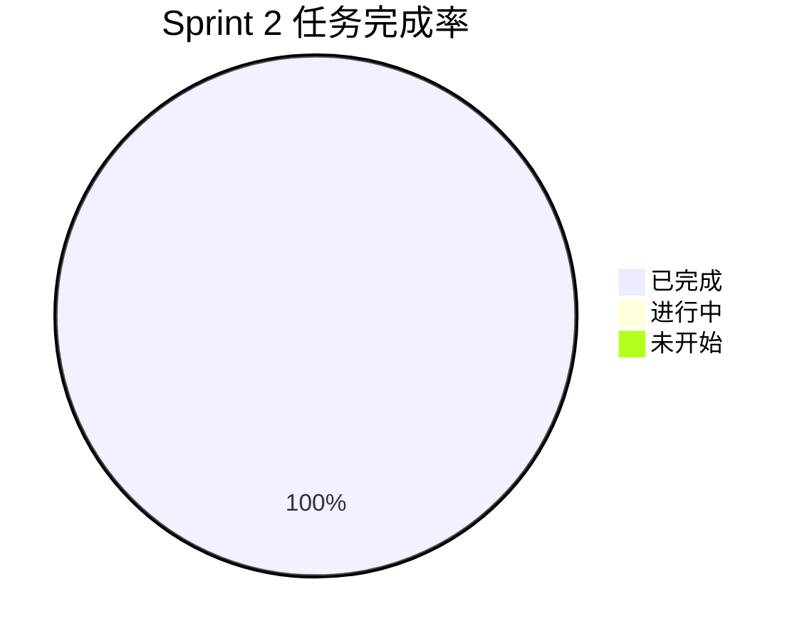

# Sprint 2 报告 · 统计、UI 增强与防御性编程

## Sprint 目标

在核心闭环之上，增加数据洞察（统计面板）、视觉升级（赛博朋克主题），并强化系统的健壮性与可观测性。

## 完成的功能点

| 编号 | 功能点 | 对应 US | 状态 |
| --- | --- | --- | --- |
| 1 | `GET /stats` 接口，返回平均分、总数、提交数、梗图数 | US01 | ✅ |
| 2 | 前端 `StatsPanel` 统计面板（卡片式布局） | US01 | ✅ |
| 3 | `ResultDisplay` 增加混乱度进度条 | US01 | ✅ |
| 4 | 赛博朋克风格 CSS（霓虹边框、发光效果） | US01 | ✅ |
| 5 | Pydantic 输入校验（长度/必填/范围约束） | — | ✅ |
| 6 | 结构化日志与异常捕获 | — | ✅ |
| 7 | 健康检查端点 `GET /health` | — | ✅ |

## 燃尽图

## 遇到的挑战与解决方案

| 挑战 | 解决方案 |
| --- | --- |
| 前端进度条视觉单调 | 使用三段渐变（青→黄→粉）模拟「混乱度」视觉冲击 |
| 统计接口被频繁调用 | 预留限流方案（slowapi 可插拔），默认 60/min |
| 跨域问题 | 后端 CORS 中间件全开放 + 前端 Vite 代理双保险 |

## 任务完成情况

## 下个 Sprint 计划

- Sprint 3 将集成 GitHub：`/github/analyze` 拉取 Diff、`/webhook/github` 处理 Push 事件、新增 `commits` 表与前端「GitHub 分析」页面。
