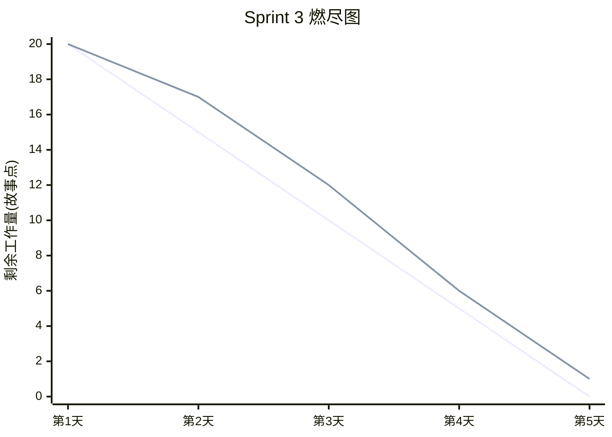
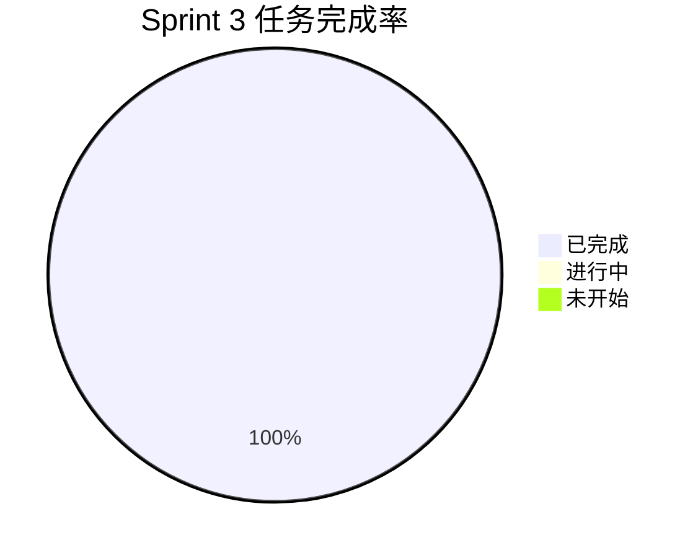

# Sprint 3 报告 · GitHub 集成与 Webhook

## Sprint 目标

打通 GitHub 生态：拉取提交 Diff 并自动评审，通过 Webhook 实现「Push 即吐槽」的持续集成体验。

## 完成的功能点

| 编号 | 功能点 | 对应 US | 状态 |
| --- | --- | --- | --- |
| 1 | `GitHubClient` 封装（httpx + `Accept: diff`） | US02 | ✅ |
| 2 | Diff 解析：提取文件列表、增删行数 | US02 | ✅ |
| 3 | `POST /github/analyze` 接口 | US02 | ✅ |
| 4 | `POST /webhook/github` Push 事件处理 | US02 | ✅ |
| 5 | Webhook HMAC-SHA256 签名校验 | US02 | ✅ |
| 6 | `commits` 表 ORM 模型与关联 | US02 | ✅ |
| 7 | 前端 `GitHubAnalyzer` 页面 | US02 | ✅ |
| 8 | 未配置 Token 时的模拟 Diff 回退 | US02 | ✅ |

## 燃尽图

## 遇到的挑战与解决方案

| 挑战 | 解决方案 |
| --- | --- |
| GitHub Diff 文本格式多样 | 用正则匹配 `diff --git`/`@@`/`+`/`-` 前缀，稳健解析 |
| 无 Token 时无法演示 | 内置 `_mock_diff` 返回示例 Diff，前端可完整体验 |
| Webhook 签名校验失败排查困难 | 使用 `hmac.compare_digest` 防时序攻击，并提供清晰 401 提示 |

## 任务完成情况

## 下个 Sprint 计划

- Sprint 4 将实现梗图生成（Pillow 四格漫画）、前端预览/下载、Docker 一键启动、CI 构建镜像与全部文档收尾。
