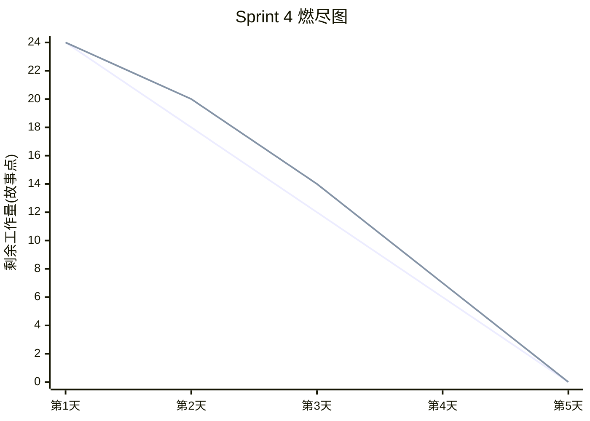

# Sprint 4 报告 · 漫画生成、导出与最终交付

## Sprint 目标

完成梗图生成与导出，补齐容器化与 CI 构建，完成全部文档与 README，达成可交付状态。

## 完成的功能点

| 编号 | 功能点 | 对应 US | 状态 |
| --- | --- | --- | --- |
| 1 | `MemeGenerator`：Pillow 四格漫画绘制 | US03 | ✅ |
| 2 | `POST /meme/{analysis_id}` 生成 PNG | US03 | ✅ |
| 3 | `GET /meme/{meme_id}` 下载 PNG | US03 | ✅ |
| 4 | `memes` 表 ORM 模型与关联 | US03 | ✅ |
| 5 | 前端 `MemeViewer` 预览 + 下载按钮 | US03 | ✅ |
| 6 | 后端/前端 Dockerfile + docker-compose | — | ✅ |
| 7 | CI 增加镜像构建步骤 | — | ✅ |
| 8 | README、系统设计、User Story、Sprint 报告全部文档 | — | ✅ |

## 燃尽图

## 遇到的挑战与解决方案

| 挑战 | 解决方案 |
| --- | --- |
| 梗图方案选型（Pillow vs SVG+cairosvg） | **选用 Pillow 模板化方案**，无图像 AI 依赖，成本低、结果确定 |
| 中文字体渲染兼容性 | 按平台回退字体路径（Windows Arial/微软雅黑 → Linux DejaVu） |
| 前端静态资源跨域 | nginx 反向代理 `/meme` 到后端，统一域名访问 |

## 最终交付清单

- ✅ 后端 4 大接口（`/roast`、`/stats`、`/github/analyze`、`/meme`）+ Webhook
- ✅ 前端 4 大页面（评审、结果、统计、GitHub 分析 + 梗图）
- ✅ 单元测试 + BDD 测试，覆盖率 ≥ 70%
- ✅ Docker 一键启动
- ✅ 完整文档（6 张系统架构图 + 3×6 张故事级图）

## 交付后的后续规划

- 接入真实 LLM 供应商（硅基流动 / DeepSeek）并调优 prompt。
- 支持流式输出（SSE），提升体验。
- 数据库切换 PostgreSQL 并增加迁移工具（Alembic）。
- 增加用户系统与梗图图库分享功能。
