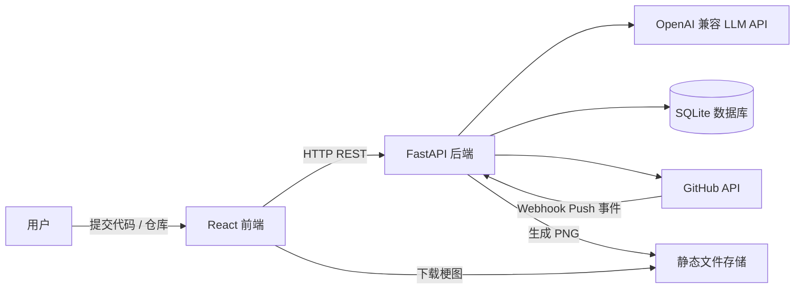
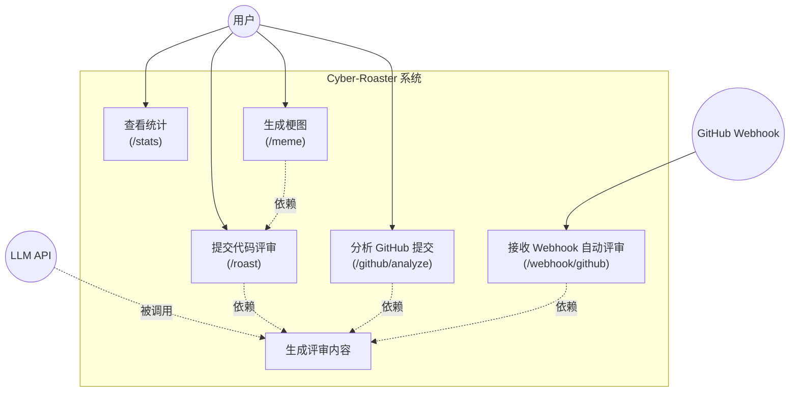
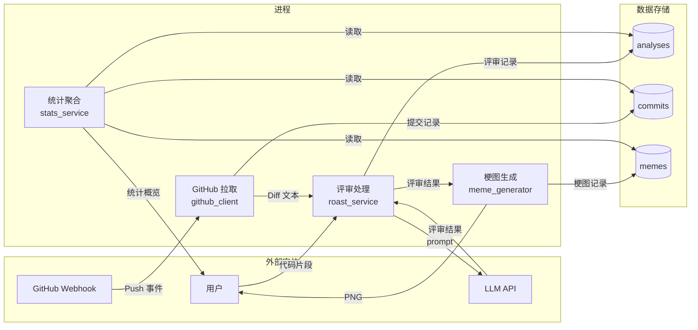
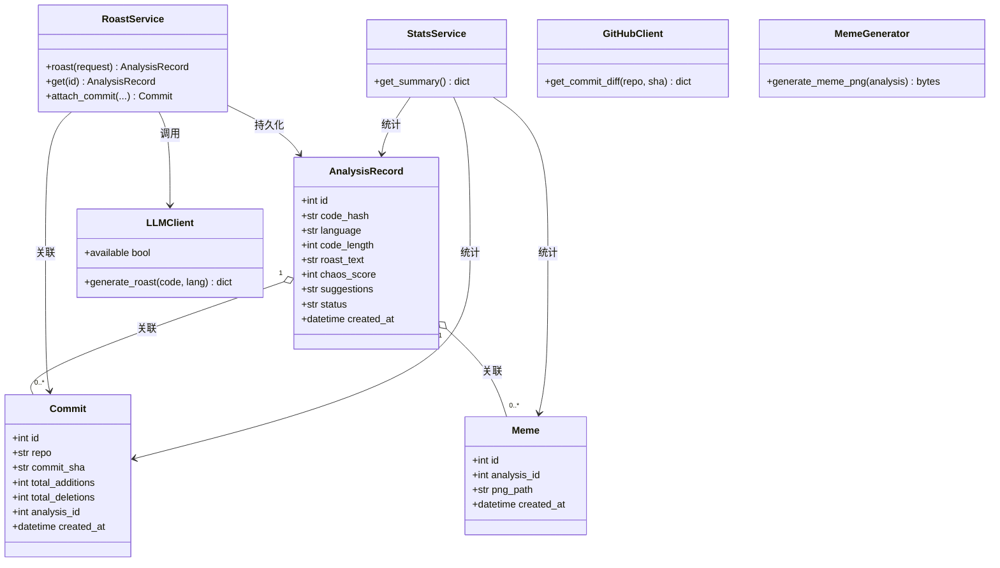
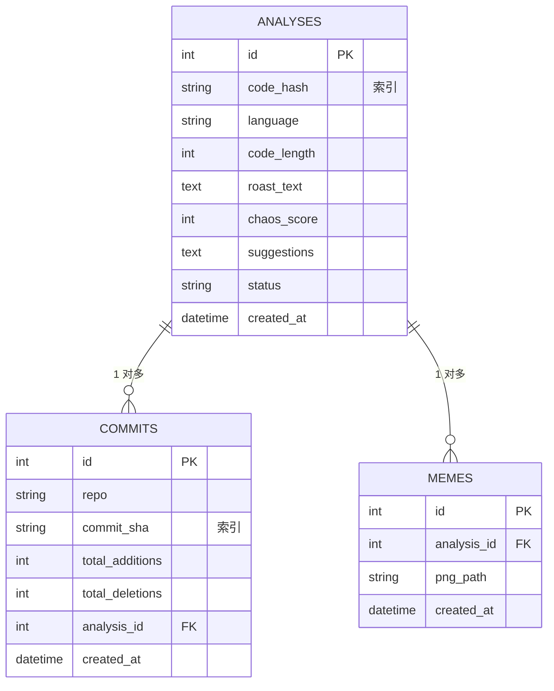
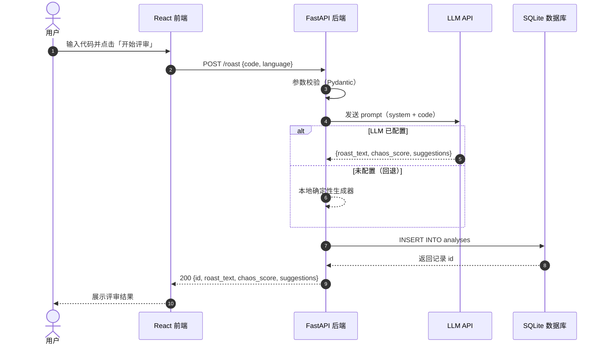
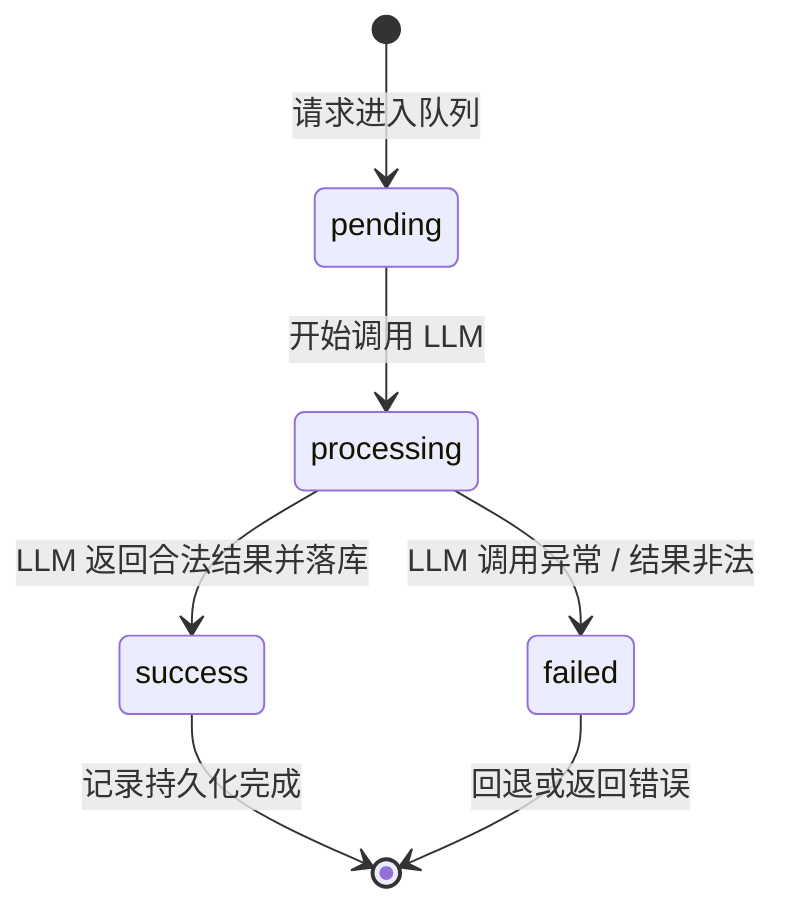

# Cyber-Roaster 系统设计文档

> 基于 AI 的幽默代码评审与梗图生成工具 · 系统级三大模型（需求 / 结构 / 行为）

- **版本**：1.0.0
- **技术栈**：FastAPI（后端） + React/Vite（前端） + SQLite（开发库） + OpenAI 兼容 LLM
- **文档约定**：所有架构图使用 Mermaid 语法；所有内容使用简体中文。

---

## 目录

1. [系统概览](#系统概览)
2. [需求模型](#需求模型)
   - 2.1 用例图
   - 2.2 数据流图（DFD）
3. [结构模型](#结构模型)
   - 3.1 领域类图
   - 3.2 ER 图
4. [行为模型](#行为模型)
   - 4.1 系统时序图
   - 4.2 状态机图
5. [技术架构与关键决策](#技术架构与关键决策)
6. [非功能需求](#非功能需求)

---

## 系统概览

Cyber-Roaster 是一个「幽默代码评审 + 梗图生成」的开发者娱乐与效率工具：

1. 用户提交代码片段（或 GitHub 仓库 + Commit SHA）。
2. 后端调用 OpenAI 兼容 LLM，生成毒舌但善意的评审（`roast_text`、`chaos_score`、`suggestions`）。
3. 后端将评审记录落库，并提供统计与梗图（四格漫画）生成能力。
4. GitHub Webhook 可在 Push 事件后自动触发评审，实现持续集成式「代码吐槽」。

---

## 需求模型

### 2.1 用例图

### 2.2 数据流图（DFD）

---

## 结构模型

### 3.1 领域类图

### 3.2 ER 图

---

## 行为模型

### 4.1 系统时序图

以下是一次完整「代码评审」调用链（前端 → 后端 → LLM → 数据库）。

### 4.2 状态机图

分析任务的生命周期（`pending → processing → success / failed`）。

---

## 技术架构与关键决策

| 决策点 | 方案 | 理由 |
| --- | --- | --- |
| LLM 接入 | `openai` 库 + `base_url` 兼容端点 | 一套代码适配硅基流动 / Azure / DeepSeek |
| 未配置密钥 | 本地确定性回退生成器 | 保证测试、演示、CI 无需外部依赖即可运行 |
| GitHub 拉取 | `httpx` + `Accept: diff` 头 | 直接拿到 unified diff，免拼接 |
| 梗图生成 | **Pillow 模板化方案（方案 A）** | 无需图像生成 AI，成本低、速度快、结果确定 |
| 数据库 | SQLite（开发）+ SQLAlchemy ORM | 可无缝切换 PostgreSQL |
| 测试 | pytest + pytest-bdd | 单测 + BDD，覆盖率目标 ≥ 70% |
| 限流 | 内置轻量方案（可扩展 slowapi） | 防御性编程，防滥用 |

---

## 非功能需求

- **性能**：单次评审响应 < 10s（含 LLM 调用）；梗图生成 < 2s。
- **可观测性**：结构化日志（`logging`），关键链路含时间戳与模块名。
- **安全**：Webhook 使用 HMAC-SHA256 签名校验；GitHub Token 仅存环境变量。
- **可移植性**：Docker 一键启动；配置全环境变量化。
- **可测试性**：核心服务与 LLM/GitHub 解耦，可注入 mock。
