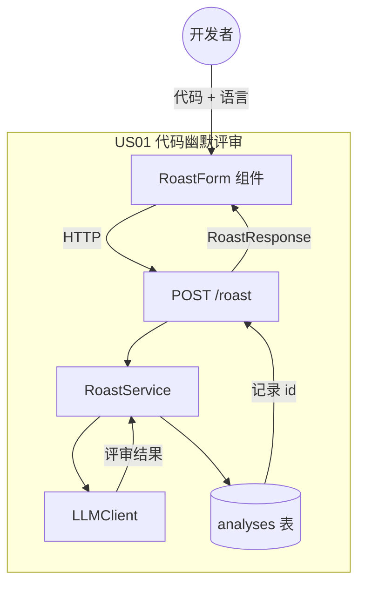
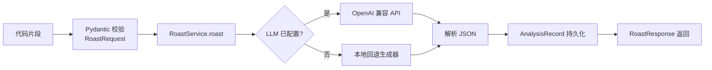
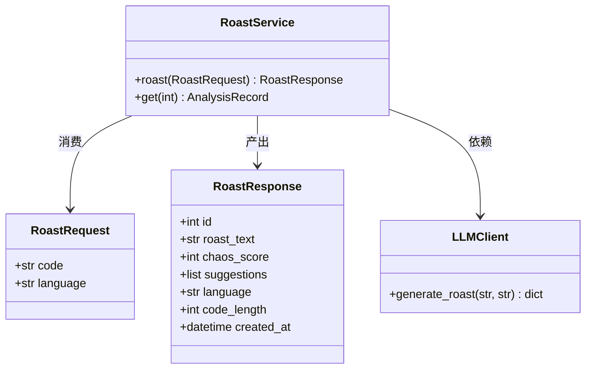
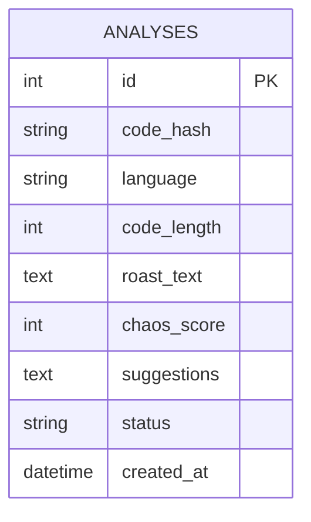
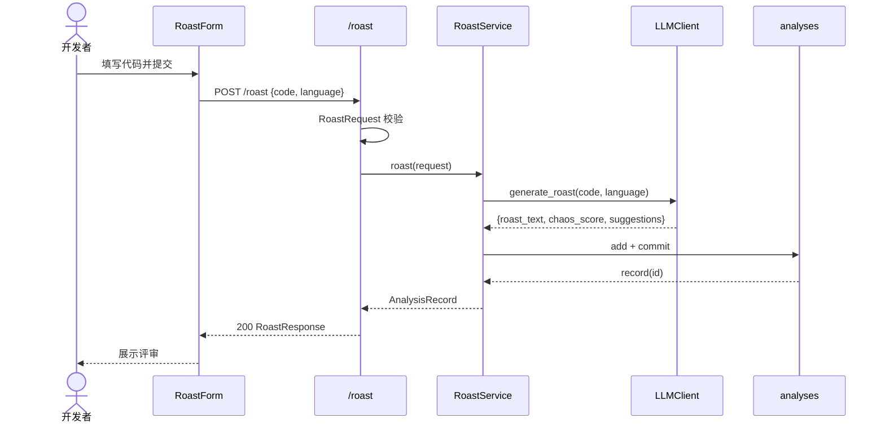
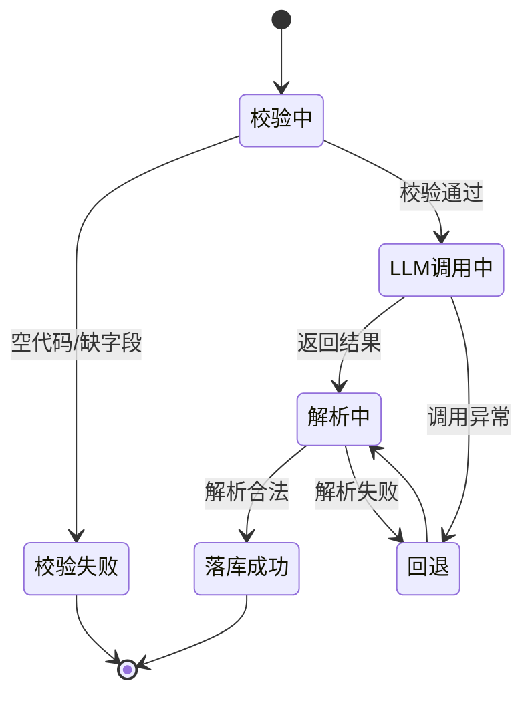

# US01 · 代码幽默评审

## 元信息

| 字段 | 内容 |
| --- | --- |
| 故事 ID | US01 |
| 标题 | 代码幽默评审 |
| 优先级 | P0（核心） |
| 所属 Sprint | Sprint 1 |
| 相关接口 | `POST /roast`、`GET /roast/{id}` |

## 故事描述

> **As a** 开发者
> **I want** 提交一段代码并获得幽默而善意的评审
> **So that** 我能在轻松的氛围里发现代码中值得改进的地方。

## 验收标准（Acceptance Criteria）

- [ ] 提交合法代码后，接口返回 `roast_text`、`chaos_score`（0–100）、`suggestions`（至少 1 条）。
- [ ] 每次评审被持久化到 `analyses` 表，含时间戳与代码长度。
- [ ] 空代码或缺失字段返回 422 校验错误。
- [ ] 可通过 `GET /roast/{id}` 查询历史评审。
- [ ] 未配置 LLM 密钥时，系统仍能返回确定性回退评审（保证演示可用）。

## Gherkin 场景

```gherkin
功能: 代码幽默评审
  作为一个开发者
  我想提交代码片段并得到幽默评审
  以便在笑声中获得改进建议

  场景: 提交合法代码获得评审
    假如 我提交了一段合法的 Python 代码
    当 我调用评审接口
    那么 接口返回 200 状态码
    并且 响应包含 roast_text 字段
    并且 响应包含 chaos_score 字段
    并且 chaos_score 在 0 到 100 之间

  场景: 提交空代码被拒绝
    假如 我提交一段空代码
    当 我调用评审接口
    那么 接口返回 422 状态码

  场景: 查询不存在的评审记录
    假如 我请求一个不存在的评审 id
    当 我调用评审查询接口
    那么 接口返回 404 状态码

  场景: 统计接口反映评审数量
    假如 我提交了一段合法的 Python 代码
    当 我调用评审接口
    并且 我调用统计接口
    那么 统计接口返回 total_analyses 为 1
```

## 故事级架构图

### 1. 故事上下文与边界图



### 2. 组件 / 数据流图



### 3. 领域类与数据契约图



### 4. 数据实体 / 持久化模型图



### 5. 端到端时序交互图



### 6. 状态机与活动流程图


