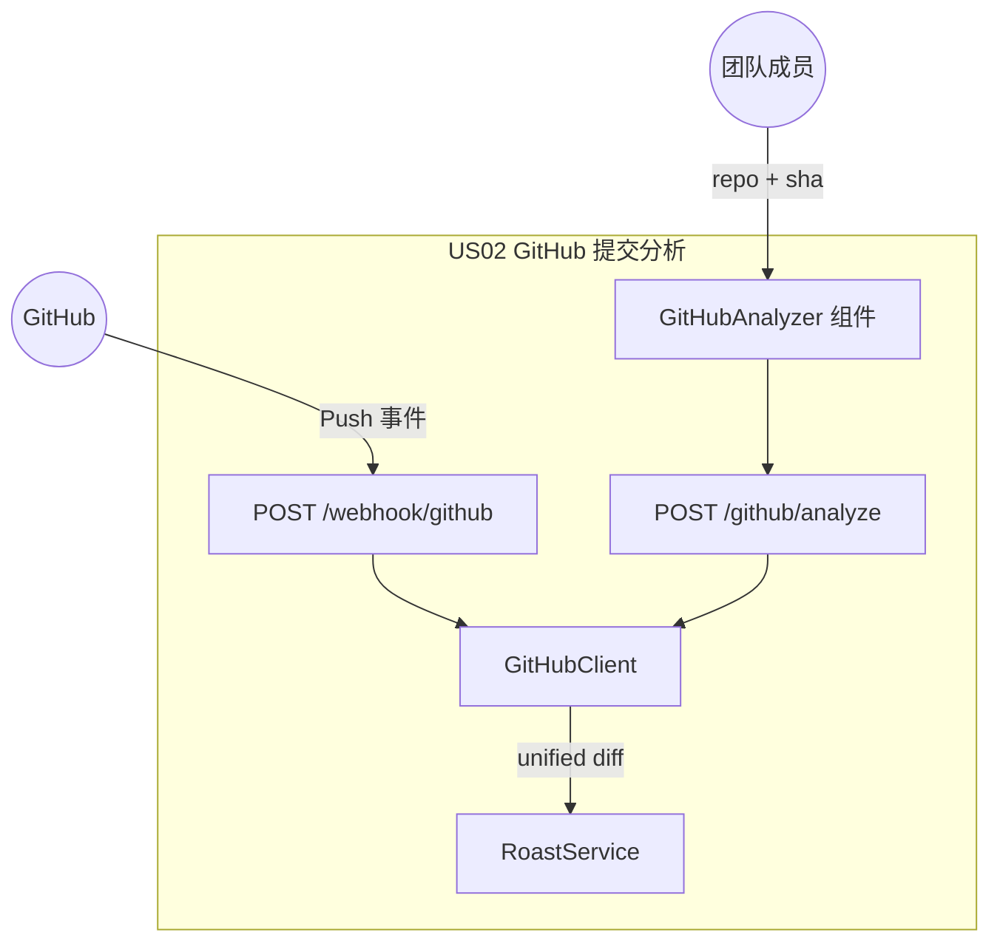
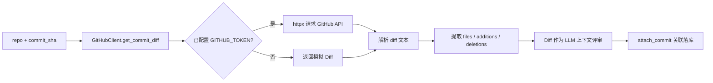
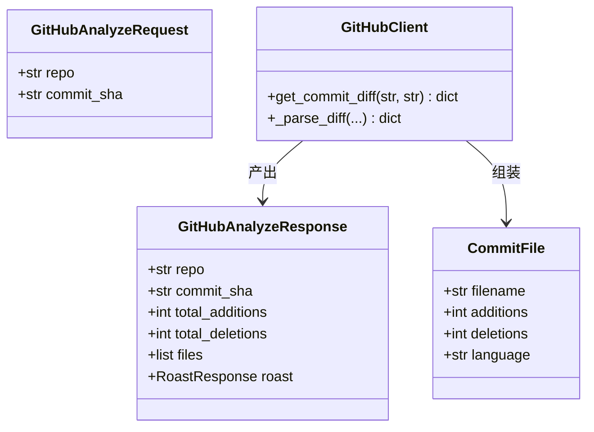
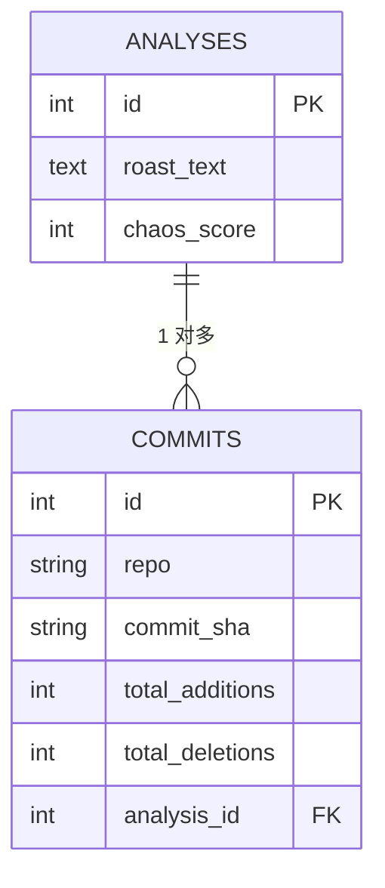
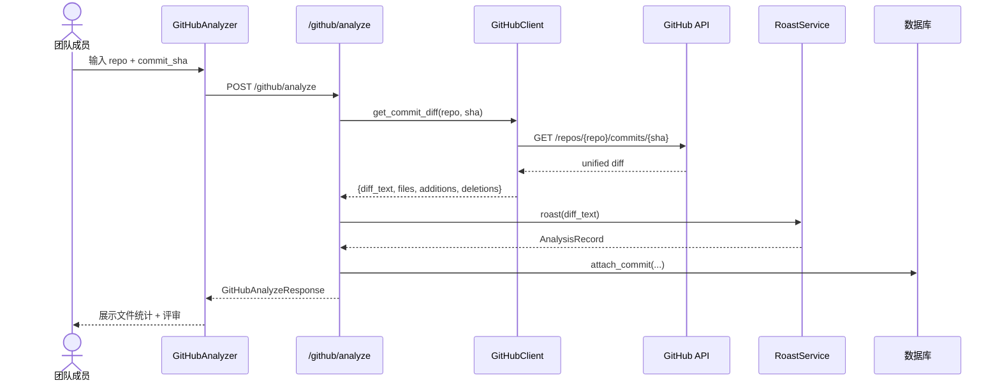
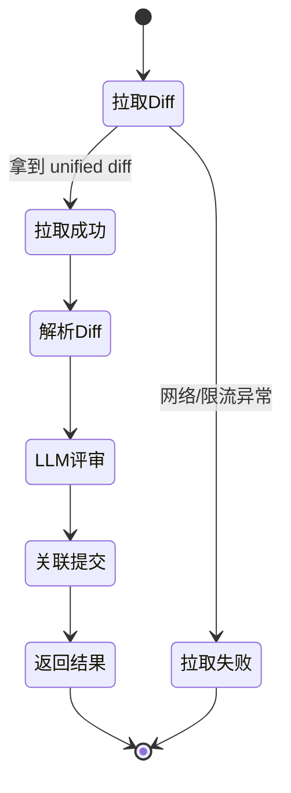

# US02 · GitHub 提交分析器

## 元信息

| 字段 | 内容 |
| --- | --- |
| 故事 ID | US02 |
| 标题 | GitHub 提交分析器 |
| 优先级 | P1（高） |
| 所属 Sprint | Sprint 3 |
| 相关接口 | `POST /github/analyze`、`POST /webhook/github` |

## 故事描述

> **As a** 团队成员
> **I want** 提交仓库地址与 Commit SHA 即可自动拉取 Diff 并分析
> **So that** 我能对每次提交获得自动化的幽默评审，而无需手动粘贴代码。

## 验收标准（Acceptance Criteria）

- [ ] 输入 `repo`（owner/name）与 `commit_sha`，接口拉取 unified diff。
- [ ] 解析 Diff，返回修改文件列表及每个文件的增删行数。
- [ ] 将 Diff 作为上下文交给 LLM 评审，并关联 `commits` 表。
- [ ] Webhook 端点能校验 HMAC-SHA256 签名，非法签名返回 401。
- [ ] Webhook 收到 Push 事件后自动触发评审并持久化。
- [ ] 未配置 `GITHUB_TOKEN` 时返回模拟 Diff，保证本地演示。

## Gherkin 场景

```gherkin
功能: GitHub 提交分析
  作为一个团队成员
  我想输入仓库与提交即可分析
  以便自动化获得提交评审

  场景: 分析有效仓库与提交
    假如 我提供了仓库名与提交 SHA
    当 我调用 GitHub 分析接口
    那么 接口返回 200 状态码
    并且 响应包含 total_additions 字段
    并且 响应包含 files 列表

  场景: 分析缺少仓库名
    假如 我提供了空的仓库名
    当 我调用 GitHub 分析接口
    那么 接口返回 422 状态码

  场景: Webhook 收到 ping 事件
    假如 GitHub 发送 ping 事件
    当 我调用 Webhook 接口
    那么 接口返回 pong 状态

  场景: Webhook 签名校验失败
    假如 我配置了 Webhook 密钥
    并且 请求携带错误签名
    当 我调用 Webhook 接口
    那么 接口返回 401 状态码
```

## 故事级架构图

### 1. 故事上下文与边界图



### 2. 组件 / 数据流图



### 3. 领域类与数据契约图



### 4. 数据实体 / 持久化模型图



### 5. 端到端时序交互图



### 6. 状态机与活动流程图


