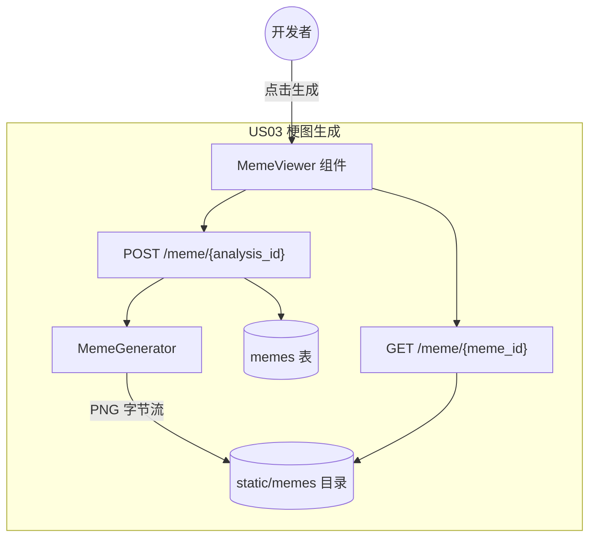
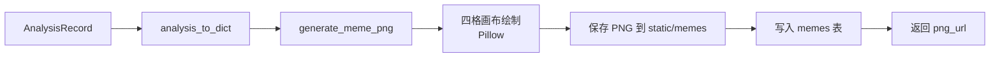
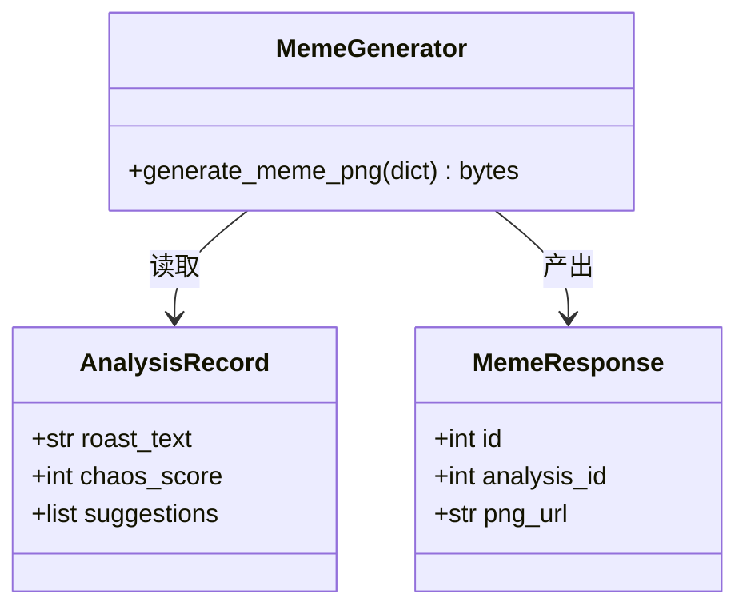
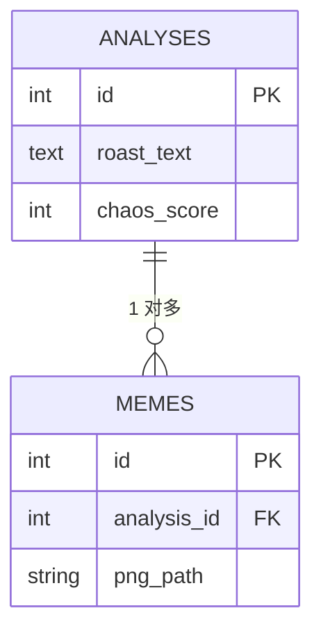
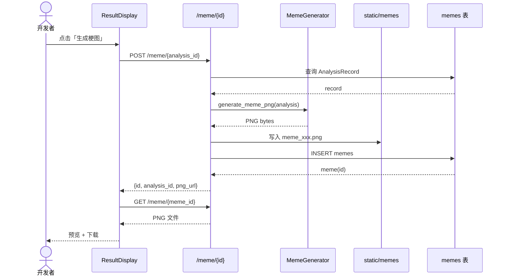
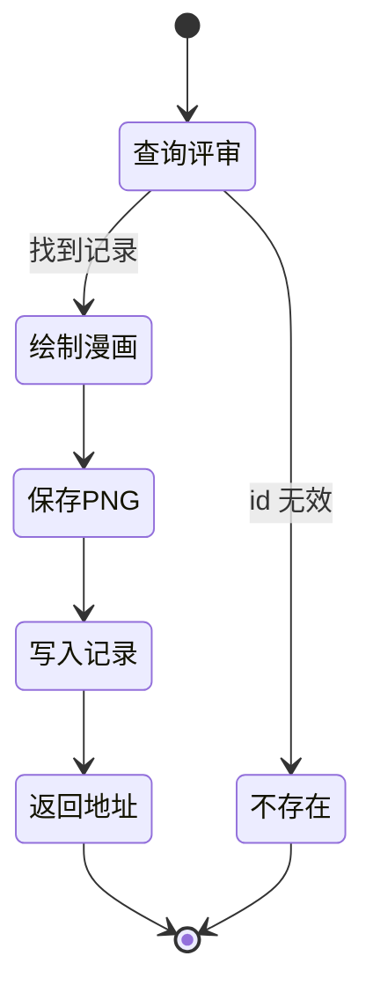

# US03 · 梗图生成器

## 元信息

| 字段 | 内容 |
| --- | --- |
| 故事 ID | US03 |
| 标题 | 梗图生成器 |
| 优先级 | P1（高） |
| 所属 Sprint | Sprint 4 |
| 相关接口 | `POST /meme/{analysis_id}`、`GET /meme/{meme_id}` |

## 故事描述

> **As a** 开发者
> **I want** 把评审结果一键生成四格漫画并下载 PNG
> **So that** 我能在社交媒体上分享这段「代码吐槽」，娱乐团队。

## 验收标准（Acceptance Criteria）

- [ ] 对已存在的评审记录，可调用 `/meme/{analysis_id}` 生成 PNG。
- [ ] 漫画为四格：案情陈述、评审毒舌、混乱度评分、改进建议。
- [ ] 评分格包含可视化评分进度条。
- [ ] 生成的 PNG 可通过 `GET /meme/{meme_id}` 下载。
- [ ] 对不存在的评审 id 返回 404。
- [ ] 使用 Pillow 模板化方案，不依赖图像生成 AI。

## Gherkin 场景

```gherkin
功能: 梗图生成
  作为一个开发者
  我想把评审结果生成四格漫画
  以便分享代码吐槽

  场景: 为已存在评审生成梗图
    假如 存在一条评审记录
    当 我调用梗图生成接口
    那么 接口返回 200 状态码
    并且 响应包含 png_url 字段

  场景: 为不存在评审生成梗图
    假如 不存在该评审记录
    当 我调用梗图生成接口
    那么 接口返回 404 状态码

  场景: 下载生成的梗图
    假如 已生成一条梗图记录
    当 我调用梗图下载接口
    那么 接口返回 PNG 图片
    并且 内容类型为 image/png
```

## 故事级架构图

### 1. 故事上下文与边界图



### 2. 组件 / 数据流图



### 3. 领域类与数据契约图



### 4. 数据实体 / 持久化模型图



### 5. 端到端时序交互图



### 6. 状态机与活动流程图


